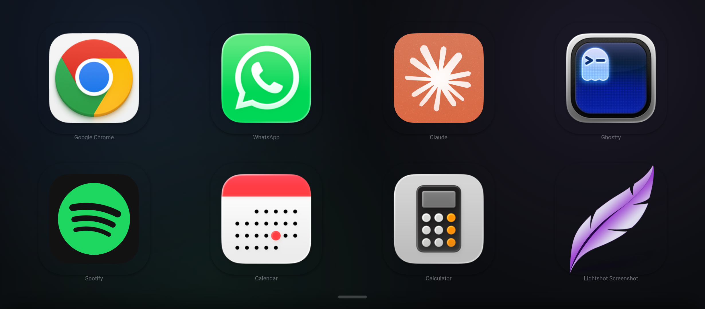
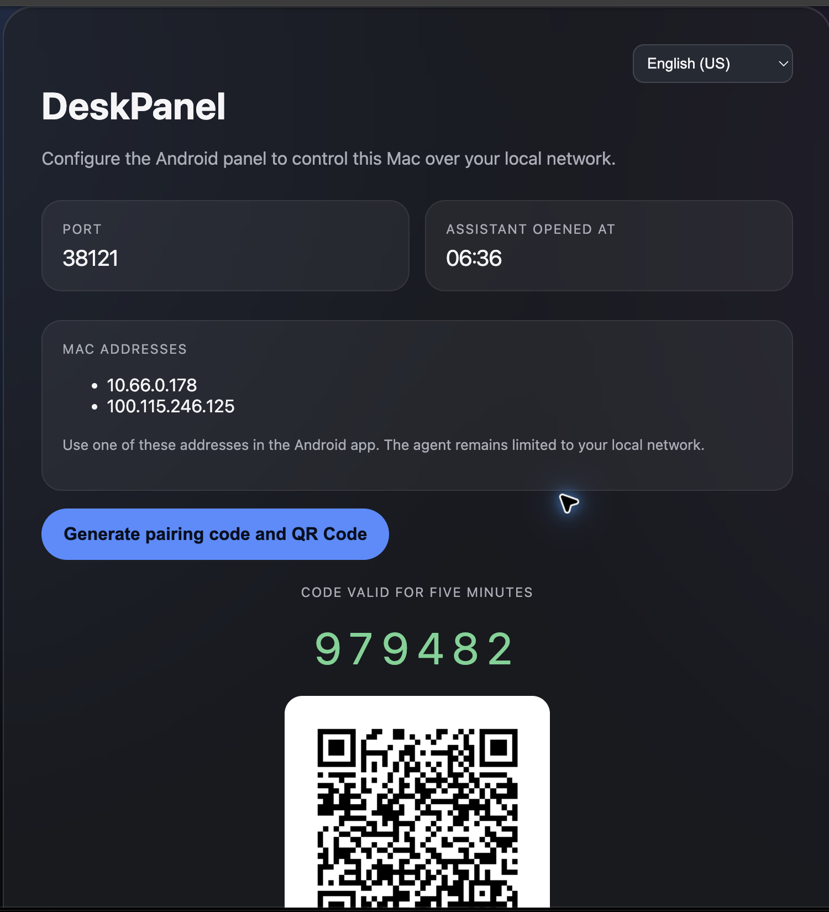
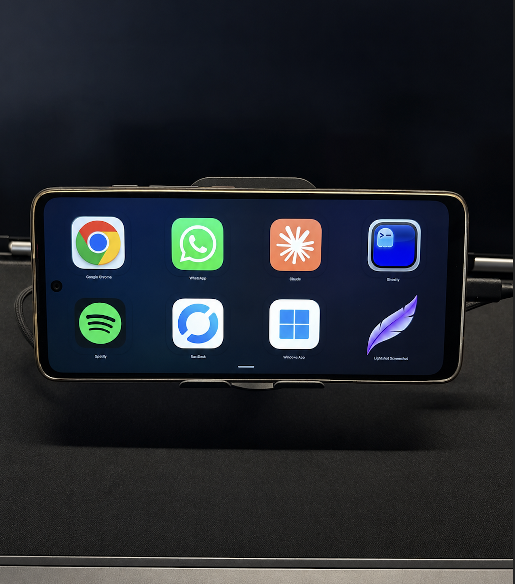

# DeskPanel

DeskPanel turns an Android phone into a customizable control panel for macOS, similar to a Stream Deck. It runs locally on your network: the Android app sends an approved action ID and the macOS agent validates and executes the matching action.

## What is included

| Component | Stack | Path | Purpose |
|---|---|---|---|
| DeskPanel Android | React, TypeScript, Vite, Capacitor | `apps/android-panel` | Touch dashboard, editor, pairing and QR scanner |
| DeskPanel Agent | Go | `apps/mac-agent` | Local macOS service that validates and executes actions |
| macOS installer | Shell, LaunchAgent, DMG | `scripts/` | One-click installation and local setup assistant |

Communication uses HTTP and WebSocket on port `38121`. The MVP is local-network only. The phone never sends arbitrary shell commands, AppleScript or URLs for execution; it sends only a preconfigured `actionId`.

## Current release

Release `v0.0.1` is the initial public release and includes the macOS installer and Android APK.

- One-click macOS DMG installer.
- `DeskPanel.app` installed in `/Applications` with a custom icon.
- Local setup page with Mac IP addresses, port and temporary QR pairing code.
- Android QR scanner for fast pairing.
- Automatic reconnection and connection status feedback.
- Customizable dashboard pages and Apple-inspired glass UI.
- Safe predefined macOS actions such as opening apps, media controls and volume control.

Download the artifacts from the [GitHub Releases page](https://github.com/RicardoPenaDev/DeskPanel/releases/tag/v0.0.1) or from [`releases/v0.0.1`](./releases/v0.0.1).

## Screenshots

### Android dashboard



### macOS setup flow

The macOS setup page is opened locally by `DeskPanel.app`. It shows the Mac's local addresses, port `38121`, and a **Generate code and QR Code** button. The generated code is temporary and is used by the Android QR scanner for pairing.



### DeskPanel on a phone stand



## Quick start for users

### macOS

1. Download `DeskPanel-0.1.1.dmg`.
2. Open it and double-click `DeskPanel Installer.app`.
3. The installer places `DeskPanel.app` in `/Applications` and starts the background agent.
4. Open the setup page when prompted.
5. Generate a temporary QR code.

macOS may ask for Accessibility or Automation permission for actions that control the system. Only grant permissions if you trust the installation and understand the action being enabled.

Because the free public build is not Apple-signed or notarized yet, macOS may show a first-launch warning. Right-click **DeskPanel Installer.app**, choose **Open**, and confirm **Open**. If necessary, use **System Settings > Privacy & Security > Open Anyway**. See the complete [macOS installation guide](./docs/INSTALL-MACOS.md).

### Android

1. Install `DeskPanel-0.1.1.apk` on the Android phone.
2. Open DeskPanel and choose **Settings > Connect to Mac**.
3. Tap **Scan QR Code** and scan the code shown by the Mac setup page.

## Development prerequisites

- macOS for building and running the agent.
- Go 1.23 or newer.
- Node.js 20 or newer.
- Corepack/pnpm.
- Android Studio SDK and an Android device or emulator.

## Development commands

```bash
make setup
make test
make lint
make verify
make build-agent
make build-apk
```

Useful direct commands:

```bash
cd apps/android-panel
corepack pnpm test
corepack pnpm build

cd ../mac-agent
go test ./...
go vet ./...
```

To build the macOS package on macOS:

```bash
scripts/build-macos-dmg.sh --version 0.1.1
```

## Repository layout

```text
apps/android-panel/       Android dashboard and QR scanner
apps/mac-agent/           Go macOS agent
configs/                  Example action catalog
docs/                     Protocol, security and installation docs
assets/                   Versioned project assets
releases/                 Public APK/DMG release artifacts
scripts/                  Build, install and packaging scripts
```

## Security model

- Local-network operation by default.
- Temporary pairing code and per-device token.
- No arbitrary shell execution from Android.
- The macOS configuration is authoritative for available actions.
- Secrets and local device state stay outside version control.
- Remote access is out of scope for the MVP; never expose port `38121` directly to the public Internet.

Read [`docs/SECURITY.md`](./docs/SECURITY.md) and [`docs/PROTOCOL.md`](./docs/PROTOCOL.md) before changing the protocol or action executor.

## Support

For support, contact **+55 16 98259-0388**.

## License

No public license has been selected yet. Until a license is added, the repository is private and the code is not granted for redistribution.
